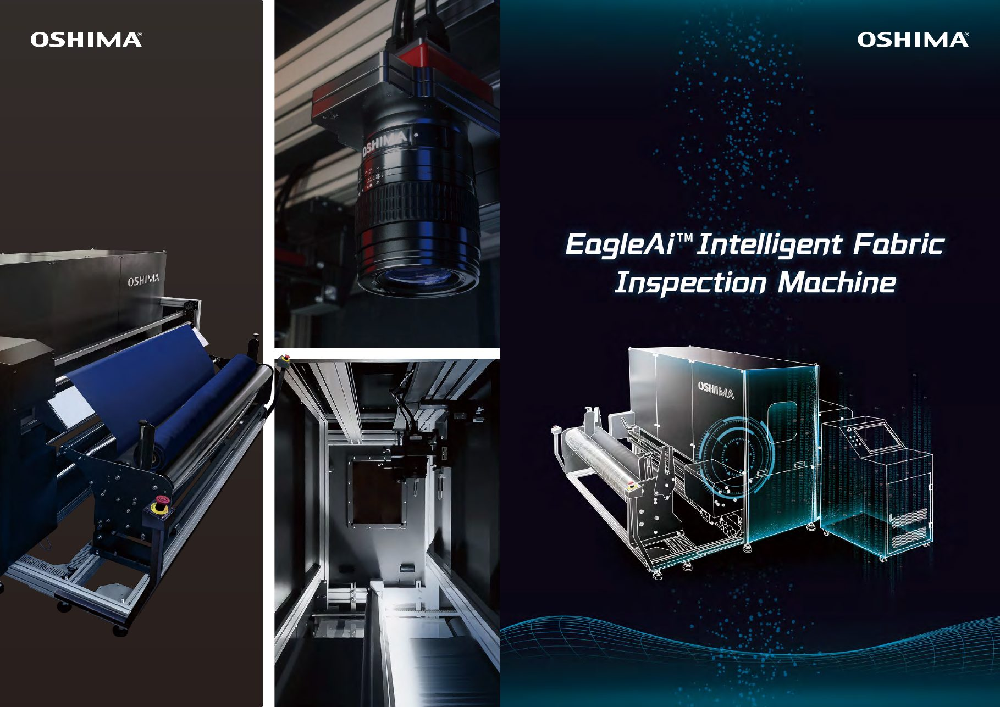
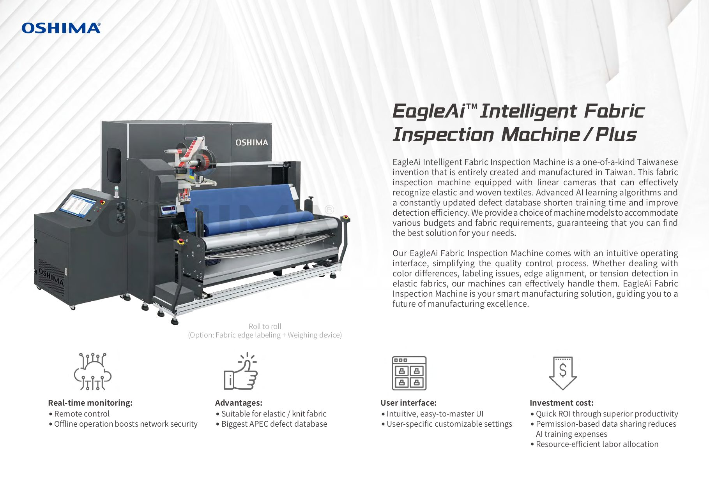
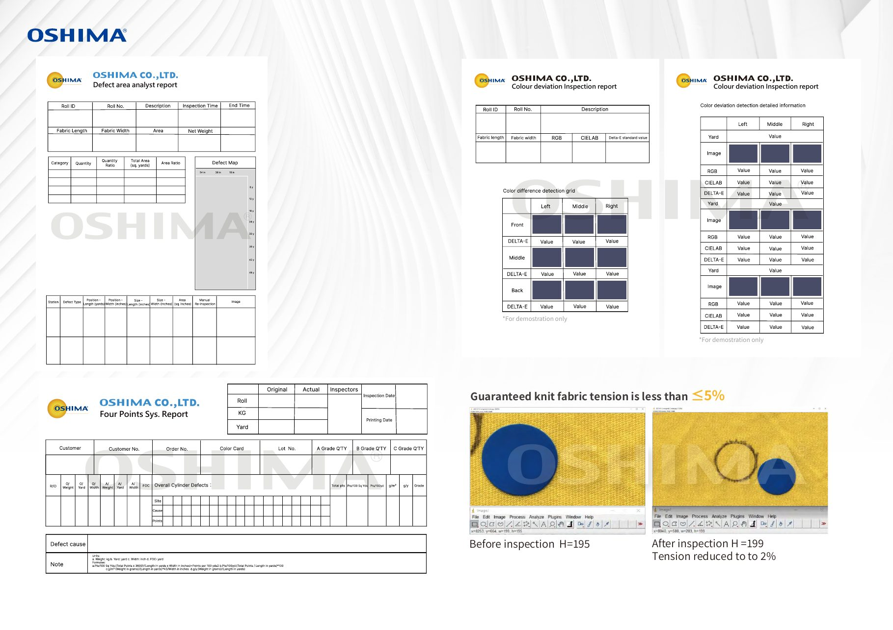
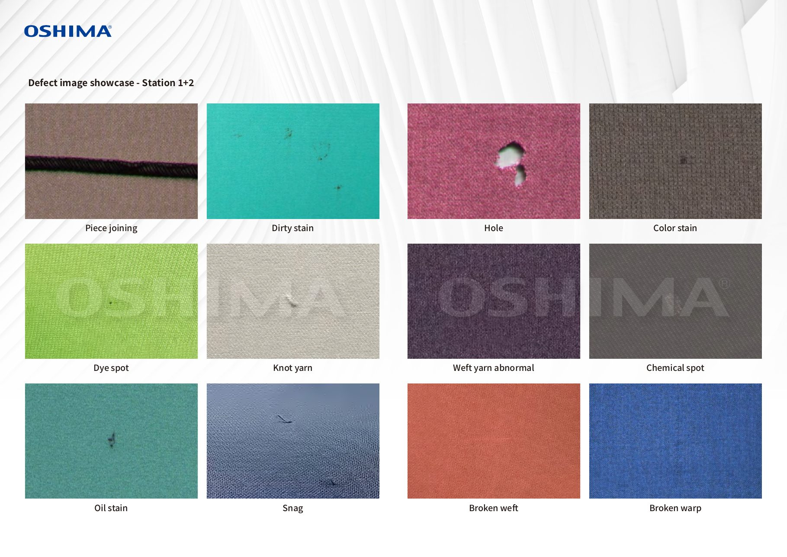
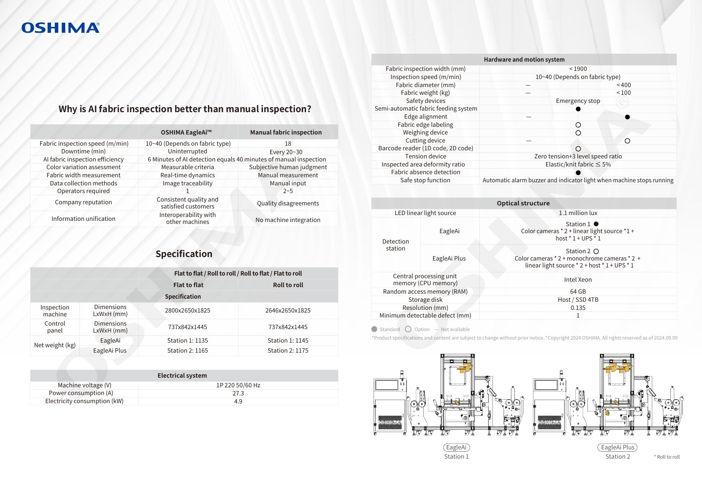
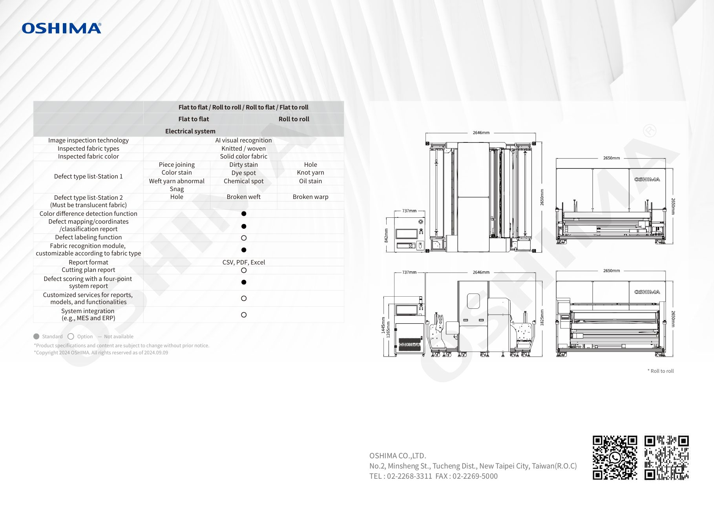

# EagleAi 型錄 v9（2024.09.09）— Hameen 客戶版

← 回到 [EagleAi 主頁](../OSHIMA-Eagle-Ai.md)

| 項目 | 內容 |
| --- | --- |
| 文件標題（PDF metadata） | `OSHIMA Eagle Ai-英文-9` |
| 檔名 | `OSHIMA_Eagle_Ai_For_Hameen.pdf`（6 頁，6.0 MB） |
| 版本日期 | Copyright 2024 OSHIMA, as of **2024.09.09** |
| PDF 建立 / 修改 | 2024-09-09 / 2024-11-19 |
| 製作工具 | Adobe Illustrator 28.6（PDF/X-4） |
| 來源 | 使用者於 2026-09-12 上傳 |

> 這是針對客戶 **Hameen** 出的版本。比 Drive 英文目錄裡的
> [v14（2026.08.04）](eagle-ai-v14-2026.md) 舊約兩年，**機台尺寸、缺陷類型數量都不同**，
> 報價與選型請以最新版為準；本頁保留下來是為了對照歷史規格。

---

## 型錄頁面

原始 6 頁以 110 dpi 算圖，版面與標註原樣保留。表格欄位對照以這些圖為準最可靠。

### P1 封面



### P2 產品介紹



### P3 報表範例



### P4 缺陷影像實例



### P5 規格表（AI vs 人工、機台 / 電氣 / 光學 / 硬體）



### P6 缺陷類型、功能配備、外觀尺寸圖



---

## v9 規格（逐項）

進料方式共四種：**Flat to flat / Roll to roll / Roll to flat / Flat to roll**；
規格表以 Flat to flat 與 Roll to roll 兩欄呈現。

### 機台尺寸與重量

| 項目 | Flat to flat | Roll to roll |
| --- | --- | --- |
| Inspection machine 尺寸 L×W×H (mm) | 2800 × 2650 × 1825 | 2646 × 2650 × 1825 |
| Control panel 尺寸 L×W×H (mm) | 737 × 842 × 1445 | 737 × 842 × 1445 |
| Net weight (kg) — EagleAi | Station 1: 1135 | Station 1: 1145 |
| Net weight (kg) — EagleAi Plus | Station 2: 1165 | Station 2: 1175 |

> P6 的三視圖另標示控制箱高度 1445 mm / 1265 mm 兩個尺寸線。

### 電氣系統

| 項目 | 數值 |
| --- | --- |
| Machine voltage (V) | 1P 220, 50/60 Hz |
| Power consumption (A) | 27.3 |
| Electricity consumption (kW) | 4.9 |

### 光學結構

| 項目 | 數值 |
| --- | --- |
| LED linear light source | 1.1 million lux |
| Detection station — EagleAi | **Station 1**（標準）：color cameras × 2 + linear light source × 1 + host × 1 + UPS × 1 |
| Detection station — EagleAi Plus | **Station 2**（選配）：color cameras × 2 + monochrome cameras × 2 + linear light source × 2 + host × 1 + UPS × 1 |
| CPU | Intel Xeon |
| RAM | 64 GB |
| Storage disk | Host / SSD 4 TB |
| Resolution (mm) | 0.135 |
| Minimum detectable defect (mm) | 1 |

### 硬體與運動系統

| 項目 | Flat to flat | Roll to roll |
| --- | --- | --- |
| Fabric inspection width (mm) | < 1900 | < 1900 |
| Inspection speed (m/min) | 10–40（依布種） | 10–40（依布種） |
| Fabric diameter (mm) | — | < 400 |
| Fabric weight (kg) | — | < 100 |
| Safety devices | Emergency stop | Emergency stop |
| Semi-automatic fabric feeding system | ● 標準 | ● 標準 |
| Edge alignment | — 不適用 | ● 標準 |
| Fabric edge labeling | ○ 選配 | ○ 選配 |
| Weighing device | ○ 選配 | ○ 選配 |
| Cutting device | — 不適用 | ○ 選配 |
| Barcode reader (1D / 2D code) | ○ 選配 | ○ 選配 |
| Tension device | Zero tension + 3 level speed ratio | 同左 |
| Inspected area deformity ratio | 彈性 / 針織布 ≤ 5% | 同左 |
| Fabric absence detection | ● 標準 | ● 標準 |
| Safe stop function | 機台停機時自動蜂鳴器與指示燈 | 同左 |

### 軟體功能與報表

| 功能 | 供應方式 |
| --- | --- |
| Image inspection technology | AI visual recognition |
| Inspected fabric types | Knitted / woven |
| Inspected fabric color | Solid color fabric |
| Color difference detection function | ● 標準 |
| Defect mapping / coordinates / classification report | ● 標準 |
| Defect labeling function | ○ 選配 |
| Fabric recognition module（可依布種客製） | ● 標準 |
| Report format | CSV, PDF, Excel |
| Cutting plan report | ○ 選配 |
| Defect scoring with a four-point system report | ● 標準 |
| Customized services for reports, models, and functionalities | ○ 選配 |
| System integration（e.g., MES and ERP） | ○ 選配 |

圖例：● 標準（Standard）／○ 選配（Option）／— 不適用（Not available）

### 缺陷類型

**Station 1（10 項）**：Piece joining、Dirty stain、Hole、Color stain、Dye spot、Knot yarn、
Weft yarn abnormal、Chemical spot、Oil stain、Snag

**Station 2（3 項，須為半透明布料）**：Hole、Broken weft、Broken warp

### 報表範例（P3）

- Defect area analyst report（缺陷分布分析）
- Four Points Sys. Report（四分制評分）
- Colour deviation Inspection report（色差檢測）× 2 種呈現
- 張力比對：`Before inspection H=…` → `After inspection H=…`，Tension reduced to …%；
  保證針織布張力 ≤ …%（型錄上的數值為示意，原檔以符號呈現）

---

## 原始擷取文字

保留版面的完整文字擷取結果：[`eagle-ai-v9-2024.raw.txt`](eagle-ai-v9-2024.raw.txt)

封面文案：

```text
Roll to roll
(Option: Fabric edge labeling + Weighing device)
```

產品介紹：

```text
EagleAi Intelligent Fabric Inspection Machine is a one-of-a-kind Taiwanese
invention that is entirely created and manufactured in Taiwan. This fabric
inspection machine equipped with linear cameras that can effectively
recognize elastic and woven textiles. Advanced AI learning algorithms and
a constantly updated defect database shorten training time and improve
detection efficiency. We provide a choice of machine models to accommodate
various budgets and fabric requirements, guaranteeing that you can find
the best solution for your needs.

Our EagleAi Fabric Inspection Machine comes with an intuitive operating
interface, simplifying the quality control process. Whether dealing with
color differences, labeling issues, edge alignment, or tension detection in
elastic fabrics, our machines can effectively handle them. EagleAi Fabric
Inspection Machine is your smart manufacturing solution, guiding you to a
future of manufacturing excellence.

Real-time monitoring:          Advantages:
 Remote control                 Suitable for elastic / knit fabric
 Offline operation boosts       Biggest APEC defect database
 network security

User interface:                Investment cost:
 Intuitive, easy-to-master UI   Quick ROI through superior productivity
 User-specific customizable     Permission-based data sharing reduces
 settings                        AI training expenses
                                Resource-efficient labor allocation
```

AI vs 人工驗布對照：

```text
                                  OSHIMA EagleAi(TM)              Manual fabric inspection
Fabric inspection speed (m/min)   10~40 (Depends on fabric type)   18
Downtime (min)                    Uninterrupted                    Every 20~30
AI fabric inspection efficiency   6 Minutes of AI detection equals 40 minutes of manual inspection
Color variation assessment        Measurable criteria              Subjective human judgment
Fabric width measurement          Real-time dynamics               Manual measurement
Data collection methods           Image traceability               Manual input
Operators required                1                                2~5
Company reputation                Consistent quality and           Quality disagreements
                                  satisfied customers
Information unification           Interoperability with            No machine integration
                                  other machines
```

公司資訊：

```text
OSHIMA CO.,LTD.
No.2, Minsheng St., Tucheng Dist., New Taipei City, Taiwan(R.O.C)
TEL : 02-2268-3311  FAX : 02-2269-5000
```
